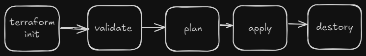
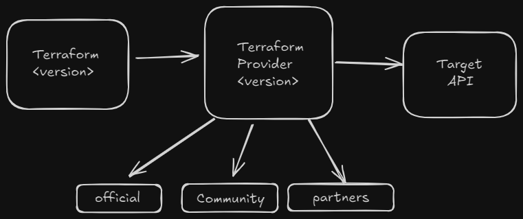
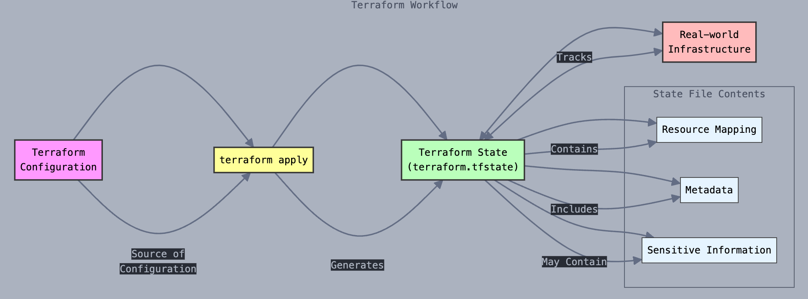

# **Deploying azure resources using Azure**

- Terraform is an Infrastructure as Code (IaC) tool by HashiCorp, used to deploy and manage resources on cloud platforms as code rather than through a graphical user interface (GUI).
 - This makes managing and sharing infrastructure much easier.

 ### Without Infrastructure as Code or terraform:

 - Slow deployment
 - Expensive
 - limited automation
 - Human error
 - repetitive
 - Inconsistency
 - wasted resources

## Why use Terraform:

For normal usage vm creation you would go to the cloud provider and build the server using the the GUI which is easy and interactive.however if the infrastructure is much bigger and need lot of resources to be deployed which would take lot of time and is subjected to human error.

**Benefits of IaaC:**
- Consistent environment
- Easy to track cost
- Write once, deploy many (single code base)
- Time saving
- Human error
- Cost saving
- Version control, changes are tracked in git
- Automated cleanup/scheduled destruction
- Easy to set and destroy
- The developer can focus on app development
- Easy to create an identical production environment for troubleshooting

### **How terraform works**

Write your terraform files --> Run terraform commands --> Call the target cloud provider API to provision the infra using Terraform Provider

**Phases:** init --> validate --> plan --> apply --> destroy



#### What  is HCL?
- It  stands for **Hashicorp configuration language**

**Syntax of HCL:**

```HCL
<block> <parameters> {
    arguments
}
```
Example :

```HCL
resource "azurerm_resource_group" "sudhi-rg" {
    name = sudheesh-rg
    location = india
}
```
Here:

`resource` is the **block type**.

 `azurerm_resource_group` is the **parameter**. 

`sudhi-rg` is the **block name**.

`name` and `location` are the **Arguments**.


## Terraform provider:



Terraform providers are plugins that enable Terraform to interact with external services or platforms, such as cloud providers, infrastructure systems, and third-party tools.

It acts as the bridge between the target API and the terraform code.

There are different types of providers:
- official - managed by hashicorp
- community - managed by open-source community
- partners - managed by both hashicorp and the partner provider.


## Provider version V/S terraform core version:

- Provider version is the version of terraform provider such as azure, aws and GCP.
- Where as the terraform core version version is the terraform CLI version.

For the code to work seamlessly without any issues it is recommended to **lock the version** both the provider and terraform version.

by doing this we can ensure that even if the code is shared it would work in other machines. as by default terraform will use the latest version and if there is any changes are made in the future version and the code is not updated this may cause some problems.

- It is recommended to use the version which is developed and tested.

### Version operators

`=` : exact match

`!=` : Exclude the exact match

`>,>=,<,<=` : Allow the right most to increment 

`~>` : only allow the right most increments

Examples:

```HCL
version = "=3.0.0"   --> exact match
version = ">= 3.0.0"    --> greater than and equal to the version
version = "~> 3.0.0"    --> version 3.0.3 , 3.0.10, 3.0.5 can be used by not 3.2.0, 3.10.0. i.e., the lat bit in the version.
```

## Terraform state file:

- Terraform state file also know as `terraform.tfstate` is a **JSON** file that acts as an persistent, up to date snapshot of the infrastructure managed by the terraform.

-  It records the current state and metadata of all resources Terraform has created, modified, or deleted, mapping them to the resource definitions in your Terraform configuration files `(.tf files)`.

- This mapping allows Terraform to determine what changes—creations, updates, deletions—need to be made to align your actual infrastructure with your configuration during each run.




### Using remote backend to store the state file:


- **Enables Team Collaboration:** Multiple people can safely work on the same infrastructure and always have access to the latest state file.
- **Provides State Locking:** Prevents simultaneous changes by different users, reducing the risk of state corruption.
- **Improves Security:** State file is encrypted at rest, with access managed through Azure RBAC. Sensitive resource data is not stored on individual computers
- **Ensures Durability:** Azure Storage offers automatic redundancy and backup, protecting the state file from loss or accidental deletion.
- **Facilitates Automation:** Allows CI/CD pipelines and automation tools to reliably access and update the state file from anywhere.
- **Avoids Local Risks:** No dependency on a single machine—state is always available, even if local hardware fails.
- **Supports Versioning:** Azure Blob Storage can provide version history and point-in-time recovery for your state files.


### How to use Azure Storage as a remote backend for your Terraform state file:

Step 1 : Create a storage account.

Step 2 : add a backend in the terraform file.

```HCL
terraform {
  backend "azurerm" {
    resource_group_name   = "tfstate"
    storage_account_name  = "<STORAGE_ACCOUNT_NAME>"
    container_name        = "tfstate"
    key                   = "terraform.tfstate"  # This can be any path/filename you wish
  }
}
```

- Here my service principle has the access to an contributor role to my subscription hence there will no issues.
- however if the your account does not have proper access this may not work and you will be requiring a SAS token, storage account access key, azure AD with manage identity.


## Variables in Terraform

Variables in terraform are used to make the configuration more flexible, reusable and modular.

There are tree types of variable:

- Input variable
- output variable
- local variable


---

### 🔹 Types of Variables in Terraform

1. **Input Variables**
   Allow users to customize Terraform modules or configurations without changing the code.

2. **Output Variables**
   Used to output information from a module or the root configuration after the apply phase.

---

### 🔸 Input Variables (Declaring)

Input variables are declared using the `variable` block:

```hcl
variable "region" {
  description = "The AWS region to deploy into"
  type        = string
  default     = "us-east-1"
}
```

You can then reference this variable using:

```hcl
provider "aws" {
  region = var.region
}
```

---

### 🔹 Variable Types

Terraform supports the following types for variables:

| Type     | Example                           |
| -------- | --------------------------------- |
| `string` | `"us-east-1"`                     |
| `number` | `5` or `5.5`                      |
| `bool`   | `true` or `false`                 |
| `list`   | `["web", "db", "cache"]`          |
| `map`    | `{ environment = "prod" }`        |
| `object` | `{ name = string, age = number }` |
| `any`    | Accepts any type                  |

---

### 🔸 Assigning Variable Values

You can assign values to variables in various ways:

1. **Command Line:**

   ```bash
   terraform apply -var="region=us-west-1"
   ```

2. **`.tfvars` file:**

   ```hcl
   region = "us-west-1"
   ```

   Then apply using:

   ```bash
   terraform apply -var-file="vars.tfvars"
   ```

3. **Environment variables:**

   ```bash
   export TF_VAR_region="us-west-1"
   ```

---

### 🔹 Output Variables

Output variables are defined using `output` block to show useful info after applying:

```hcl
output "instance_ip" {
  value = aws_instance.web.public_ip
}
```

---

### 🔸 Example

```hcl
# main.tf
variable "instance_type" {
  type    = string
  default = "t2.micro"
}

resource "aws_instance" "web" {
  ami           = "ami-12345678"
  instance_type = var.instance_type
}

output "instance_id" {
  value = aws_instance.web.id
}
```

---


---

### 🔺 Precedence 
| Precedence | Source                                                             |
| ---------- | ------------------------------------------------------------------ |
| 🥇 Highest | Command line `-var` and `-var-file`                                |
| 🥈         | Auto-loaded `.auto.tfvars` and `.auto.tfvars.json` (lexical order) |
| 🥉         | `terraform.tfvars.json`                                            |
| 4️⃣        | `terraform.tfvars`                                                 |
| 5️⃣ Lowest | Environment variables (`TF_VAR_`)                                  |

> 🔸 **Note:** Default values defined in the `variable` blocks are only used **if no value is provided from any of the above sources**.

---


## Terraform File Structure

Terraform project structure is simple and flexible. Here’s a **typical file/folder layout** used in most Terraform projects:

---

###  Basic File Structure

```
my-terraform-project/
├── main.tf           # Main configuration (resources, providers)
├── variables.tf      # Input variables declared here
├── outputs.tf        # Output values shown after apply
├── terraform.tfvars  # Variable values (optional)
├── backend.tf        # Remote backend config (optional)
├── versions.tf       # Provider and Terraform version constraints (optional)
└── .terraform/       # Internal Terraform state & plugin files (auto-created)
```

---


| File/Folder                | Purpose                                           |
| -------------------------- | ------------------------------------------------- |
| `main.tf`                  | Primary config: resources, provider setup, etc.   |
| `variables.tf`             | Declares input variables with `variable` blocks   |
| `terraform.tfvars`         | Supplies values for variables (`key = value`)     |
| `outputs.tf`               | Declares `output` blocks to export values         |
| `backend.tf`               | Configures remote state (e.g., S3, Azure blob)    |
| `versions.tf`              | Locks provider and Terraform versions             |
| `.terraform/`              | Terraform internal files (don't edit manually)    |
| `terraform.tfstate`        | Tracks the actual deployed state (auto-generated) |
| `terraform.tfstate.backup` | Backup of the last state file                     |

---


