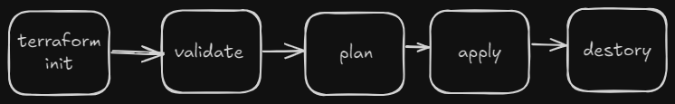

# **Deploying azure resources using Azure**

- Terraform is an Infrastructure as Code (IaC) tool by HashiCorp, used to deploy and manage resources on cloud platforms as code rather than through a graphical user interface (GUI).
 - This makes managing and sharing infrastructure much easier.

 ### Without Infrastructure as Code or terraform:

 - Slow deployment
 - Expensive
 - limited automation
 - Human error
 - repetitive
 - Inconsistency
 - wasted resources

## Why use Terraform:

For normal usage vm creation you would go to the cloud provider and build the server using the the GUI which is easy and interactive.however if the infrastructure is much bigger and need lot of resources to be deployed which would take lot of time and is subjected to human error.

**Benefits of IaaC:**
- Consistent environment
- Easy to track cost
- Write once, deploy many (single code base)
- Time saving
- Human error
- Cost saving
- Version control, changes are tracked in git
- Automated cleanup/scheduled destruction
- Easy to set and destroy
- The developer can focus on app development
- Easy to create an identical production environment for troubleshooting

### **How terraform works**

Write your terraform files --> Run terraform commands --> Call the target cloud provider API to provision the infra using Terraform Provider

**Phases:** init --> validate --> plan --> apply --> destroy



#### What  is HCL?
- It  stands for **Hashicorp configuration language**

**Syntax of HCL:**

```HCL
<block> <parameters> {
    arguments
}
```
Example :

```HCL
resource "azurerm_resource_group" "sudhi-rg" {
    name = sudheesh-rg
    location = india
}
```
Here:

`resource` is the **block type**.

 `azurerm_resource_group` is the **parameter**. 

`sudhi-rg` is the **block name**.

`name` and `location` are the **Arguments**.


